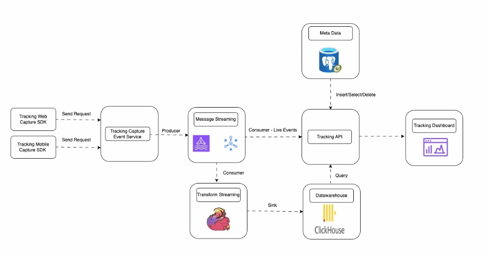

# Tracking Autocapture
[](https://hub.docker.com/r/vantuan12345/airlake/)
[](https://hub.docker.com/r/vantuan12345/tracking-autocapture-service/)
[](https://hub.docker.com/r/vantuan12345/tracking-autocapture-api/)


## Diagram Architecture

<div align="center">
    
</div>

## SDK
**Node Js**
```js
const tracking = new TrackingCapture({
    URL: 'http://localhost:8080',
    API_KEY: 'xxx',
    API_ID: 'xxx'
})
tracking.capture(
    'event': 'impression',
    {
    "clientId": "exampleClientId",
    "actionName": "impression",
    "createdAt": 1693401600000,
    "eventProperties": {
        "property1": "value1",
        "property2": "value2"
    },
    "userProperties": {
        "userId": "exampleUserId",
        "userName": "exampleUserName"
    },
    "deviceProperties": {
        "deviceId": "exampleDeviceId",
        "deviceType": "exampleDeviceType"
    },
    "eventType": "exampleEventType",
    "page": "examplePage",
    "referrer": "exampleReferrer",
    "platform": "examplePlatform",
    "version": "v1"
    }
)
```

**React Js**
```jsx
const tracking = new TrackingCapture({
    URL: 'http://localhost:8080',
    API_KEY: 'xxx',
    API_ID: 'xxx'
})
tracking.capture(
    'event': 'impression',
    {
    "clientId": "exampleClientId",
    "actionName": "impression",
    "createdAt": 1693401600000,
    "eventProperties": {
        "property1": "value1",
        "property2": "value2"
    },
    "userProperties": {
        "userId": "exampleUserId",
        "userName": "exampleUserName"
    },
    "deviceProperties": {
        "deviceId": "exampleDeviceId",
        "deviceType": "exampleDeviceType"
    },
    "eventType": "exampleEventType",
    "page": "examplePage",
    "referrer": "exampleReferrer",
    "platform": "examplePlatform",
    "version": "v1"
    }
)

```


## Get started
**Prerequire**
**Setup**


## Contributing
The project has a separate contribution file. Please adhere to the steps listed in the separate contributions [file](./CONTRIBUTING.md)

## License
[](./LICENSE)◊